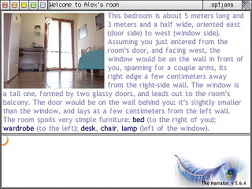

# Narrator

The Narrator is a framework to build and play point-and-click adventure games, first published in 2003 by Alessandro Ghignola.

## How to use it
Narrator was written in LinOLEUM. Unfortunately, the LinOLEUM runtime is known to be detected as malware by modern antivirus programs, which means you won't be able to run the provided .exe file unless you flag it as a false positive.
Even then, it doesn't seem to work on my Windows 11 machine, but I remember running it on Windows XP.

As it stands, there is no guarantee that you will be able to run Narrator on your system; the only guarantee is you won't be infected by malware!

If you do manage to get it working, the next steps are detailed by Alex in the file `How to use The Narrator.txt`.
